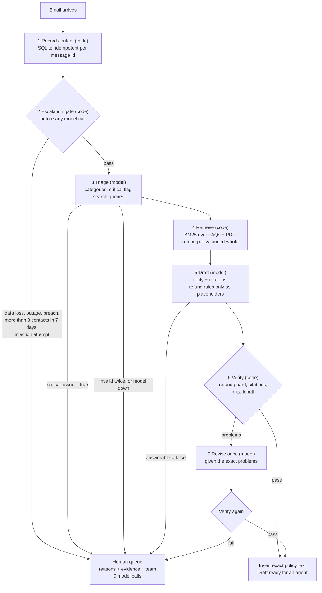

# Architecture

This document explains the design of all three parts, with most detail on Part 1
(the support-email agent). It covers the trade-offs, how each failure is handled,
and what would change at production scale.

## Design principles

1. **The model plans and writes; code decides and verifies.** Every safety decision
   (escalation, refund facts, summary length, calculator safety) is deterministic code
   with unit tests. Prompts help, but they are never the only control.
2. **Fail closed.** When something is uncertain, invalid or down, the email goes to a
   human. A failure never produces an automatic reply.
3. **The model can only escalate up, never down.** It can add a reason to send an
   email to a human (`critical_issue`, `answerable: false`). It can never remove a
   reason that the rules found.
4. **Every failure has a named outcome and a test.** See the failure tables below.
5. **One trace id per request.** Every log line for one email, page or chat turn
   carries the same id, so a request can be followed end to end. Logs never contain
   the API key, prompts or email bodies, and email addresses are hashed.

## Shared toolkit (`agentkit/`)

| Module | What it does |
|---|---|
| `llm.py` | One `generate()` interface over Gemini (`generateContent` REST) and OpenAI (Responses API), plus `FakeClient` for offline tests and `FaultyClient` for chaos tests. Plain HTTPS with `httpx`; no vendor SDK. |
| `resilience.py` | Retry policy (exponential backoff with full jitter, honours `Retry-After`), circuit breaker, client-side requests-per-minute limiter. |
| `jsonout.py` | Parse JSON from model text, validate it in code, and ask once more with the exact error if it is wrong. |
| `obs.py` / `metrics.py` | JSON logs with a trace id (`ContextVar`), timed spans, counters and p50/p95 latencies for run reports. |
| `injection.py` | Wrap untrusted text in tags (and strip copies of those tags), flag common injection phrases. |
| `config.py` | Settings from environment / `.env`; the key is excluded from `repr()`. |

**Error mapping.** Each model failure becomes exactly one exception type, so callers choose an outcome
by type: `LLMUnavailable` (timeout, 5xx, 429 after retries, circuit open), `LLMBadRequest` (4xx:
wrong model, payload or key, not retried), `LLMBlocked` (safety refusal), `LLMOutputError` (empty,
cut off or malformed answer).

**Provider details that matter.** Gemini 3 models attach a *thought signature* to tool-call parts,
and it must be sent back unchanged. OpenAI reasoning models return reasoning items that must be
sent back too. So each assistant message keeps the provider's raw payload and echoes it back
verbatim. The key is sent only in a header (`x-goog-api-key` / `Authorization`), never in a URL.

---

## Part 1: support-email agent

### Flow



| Step | Who decides | Output | If it fails |
|---|---|---|---|
| 1 Record contact | code | contact stored, count in the last 7 days | (SQLite is local; a bug is caught by the batch runner, see below) |
| 2 Escalation gate | code | reasons + the text that triggered each one | n/a: no external dependency |
| 3 Triage | model, validated by code | `categories[]`, `critical_issue`, `kb_queries[]`, `summary` | repair once, then human (`triage_failed` / `llm_unavailable`) |
| 4 Retrieve | code | up to 6 FAQ/PDF chunks, plus all refund clauses if refunds come up | no chunk found: human (`not_answerable_from_kb`) |
| 5 Draft | model | `{answerable, reply, citations}` | repair once, then human (`draft_failed` / `llm_unavailable`) |
| 6 Verify | code | list of problems | problems: go to step 7 |
| 7 Revise | model, then code again | corrected draft | still failing: human (`verification_failed`, problems attached) |

This is a **plan, act, critique, revise** pattern. The model plans the search (triage writes the
queries), code executes the plan (retrieval), the model drafts, code critiques the draft, and the
model revises with that critique. The code also bounds the loop: there is exactly one revision.

### Classification (requirement 1)

Triage returns one or more categories from a fixed list: **Billing, Technical, Feedback, Other**.
An email can be both Billing and Technical (sample email `e11`). Code rejects unknown categories,
and the model gets one chance to fix them. The categories are recorded on every decision. They
are used for the human team hint and for reporting.

### Grounded drafting (requirement 2)

The knowledge base is three Markdown FAQs, the refund policy, and a PDF product guide (read with
`pypdf`). Each section or page becomes a chunk with an id like `billing_faq#invoices`. Retrieval
is BM25 in pure Python. The drafting prompt allows facts only from the `<knowledge>` block, and the
reply must cite the chunk ids it used. Code checks that every citation was in the context and that
every link or email address in the reply appears in the knowledge base. That last check blocks
phishing links that an injected email might try to plant.

### Escalation to humans (requirement 3)

The gate runs **before any model call**, in `part1_support/escalation.py`:

- **Data loss, service outage, security breach:** regular expressions over the subject and body,
  after Unicode NFKC normalisation and case folding (so full-width "ｏｕｔａｇｅ" still matches).
- **More than 3 contacts in 7 days:** contacts are stored in SQLite. The count includes the current
  email, and the window is `received_at - 7 days < t <= received_at`. **So the 4th email in 7 days
  is escalated, and a contact exactly 7 days old is outside the window.** This reading of "more
  than 3 times in 7 days" is an assumption; it is one constant and one SQL condition if PointStar
  means something else. The tests pin both edges (3 vs 4 contacts; exactly 7 days vs 6 days 23 h).
- **Prompt injection signals** ("ignore previous instructions", fake `</email>` tags, ...): these
  also send the email to a human (team `trust-and-safety`).

Escalated emails make **zero** model calls. This has three benefits. A model can never be talked
out of an escalation. The most urgent emails are routed correctly even during a model outage.
And no money is spent on emails a person will handle anyway.

Counting by timestamp, plus `INSERT OR IGNORE` on the message id, makes the count
**idempotent** (a retried email counts once) and **order-independent** (parallel workers get the
same answer as one worker). The batch runner records all contacts first, then processes in
parallel.

### No hallucinated refund policy (requirement 4)

The model is **not allowed to write refund rules at all**. To state one, it writes a placeholder
such as `{{policy:R1}}`. Code checks the draft (`refund_guard.py`):

1. every placeholder names a real clause, and that clause was in the retrieved context;
2. no sentence outside a placeholder talks about refunds **and** makes a claim (a number, a
   duration, a percentage, "full", "eligible", "will refund", "non-refundable", ...). For any
   number in such a sentence that is missing from the policy text, the error message names it.

Only after the check passes, code replaces each placeholder with the clause text, character for
character, in quotes. **Refund facts in a draft can therefore only come from the policy document.**
The guard runs on every draft, including Technical ones, because a model may offer "a refund as
an apology" anywhere. If the check fails, the model revises once with the exact problems. If it
fails again, the email goes to a human, with the problems attached (fail closed).

The refund policy is retrieved **all or nothing**. When the email or the triage queries mention
refunds, all six clauses go into the context. Otherwise none do. This keeps retrieval misses from
hiding the clause that applies.

### Prompt injection

Untrusted text (emails, web pages, documents) is wrapped in tags, and any copy of those tags is
removed from it. The system prompt says the content is data. That is only the first layer. The
layers that matter are in code: the gate, the refund guard, the citation and link checks, and the
fixed category list. A successful injection can at most make the model write a bad draft, and the
verifier then rejects it. Sample email `e11` reaches the model with a social-engineering bait ("your
colleague promised a 100% refund + 3 free months"). The guard blocks any draft that repeats it.

### Trade-offs

| Decision | Chosen | Alternative | Why | Weakness we accept |
|---|---|---|---|---|
| Escalation rules | regex in code, before the model | ask the model | deterministic, cannot be argued with, works during outages, unit-testable | misses paraphrases and misspellings; over-escalates on negation ("no outage"). Partly covered by the model's `critical_issue` flag, which can only add an escalation |
| Refund facts | placeholders filled from the policy | let the model paraphrase, then fact-check | a wrong paraphrase is impossible by construction | replies sound formal; the model can pick a real but wrong clause; the claim detector is a strict heuristic, which creates extra human reviews |
| Retrieval | BM25, pure Python | embeddings + vector DB | no extra dependency, cost or network; deterministic | matches words, not meaning; mitigated by model-written queries and by pinning the policy |
| Orchestration | explicit state machine + hand-written loop | LangGraph / CrewAI | every step is visible and explainable; few dependencies | no built-in checkpointing or graph UI; more code to own |
| Escalated emails | no draft at all | draft a suggestion for the human | zero model risk on the critical path; cheaper | the human starts from a blank reply |
| Concurrency | thread pool in one process | async workers + queue | model calls are I/O-bound, so threads scale well enough here | one process, one machine |
| Contact store | SQLite (stdlib) | Postgres / Redis | transactional, zero setup | local to one node |

### Failure modes (Part 1)

| Failure | Detection | Outcome | Test |
|---|---|---|---|
| Model down, timeout, 5xx, 429 | `LLMUnavailable` after 3 attempts with jittered backoff (honours `Retry-After`) | human (`llm_unavailable`); the gate already ran, so critical emails are still routed correctly | `test_model_outage_at_triage_fails_closed`, `test_retries_a_503_then_succeeds` |
| Provider keeps failing | circuit breaker opens after 5 failed calls in a row | calls fail fast (no waiting on timeouts) for 30 s, then probe again | `test_circuit_opens_and_then_fails_fast_without_network` |
| Wrong model name / bad key | 4xx, `LLMBadRequest`, not retried | human; the error message names the provider's reason | `test_400_is_not_retried` |
| Malformed or invalid JSON | parser + validator in code | one repair attempt with the exact error, then human | `test_unusable_triage_twice_fails_closed`, `test_invented_category_is_rejected_then_repaired` |
| Invented refund term | refund guard | one revision, then human | `test_model_that_invents_a_refund_term_twice_goes_to_a_human` |
| Invented citation or link | verifier | one revision, then human | `test_citation_outside_the_context_triggers_a_revision`, `test_link_that_is_not_in_the_kb_is_never_sent` |
| Injection in an email | gate signals; code-only safety checks | obvious attempts go to a human; subtle ones still meet the guard | `test_prompt_injection_goes_to_a_human` |
| Duplicate delivery | message id is the primary key | counted once | `test_same_message_recorded_twice_counts_once` |
| Bug in our code | catch-all at the batch boundary | human (`internal_error`), stack trace logged | `test_a_bug_in_processing_becomes_a_human_route_not_a_crash` |
| Load spike, rate limits | RPM limiter, bounded workers, `Retry-After` | slower, not failing | `scripts/load_test_part1.py` |

**Load test** (offline, `scripts/load_test_part1.py`): 500 emails, 16 workers, a fake model with
50 ms latency and 10 % injected outages. Every email got a defined route. Throughput was about
311 emails/s, against 20 emails/s with 1 worker. This measures the pipeline's own overhead and its
concurrency. Real throughput is bounded by the provider's rate limit, not by this code.

### What would change at production scale

- **Ingestion:** a queue (for example SQS or Pub/Sub) with the Message-ID as idempotency key, a
  dead-letter queue, and autoscaled stateless workers instead of one process.
- **Identity and history:** contact history in Postgres or Redis, keyed by the CRM customer id, not
  by the email address (one person can write from several addresses).
- **Retrieval:** hybrid search (BM25 + embeddings), a versioned KB, and policy clauses managed with
  stable ids in a CMS, so the placeholder approach keeps working.
- **Humans in the loop:** a review UI that shows the reasons, the evidence and the verified draft.
  Agent edits become labelled data. Low-risk categories are auto-sent only after measured quality.
- **Evaluation in CI:** a labelled email set, with recall of the escalation rules, classification
  accuracy and the guard's false-positive rate tracked on every change.
- **Observability:** export the existing spans to OpenTelemetry (the trace id is already threaded
  through), with dashboards for route and reason rates, model latency, errors and token cost, and
  alerts on `llm_unavailable` spikes.
- **Privacy:** redact personal data before the model where possible; set retention rules and a
  data region.
- **Model fallback:** the client interface is provider-neutral, so a second provider can take over
  when the circuit opens.

---

## Part 2: scraper + summariser

Full diagnosis: [PART2_DIAGNOSIS.md](PART2_DIAGNOSIS.md). PointStar did not supply the script, so
`part2_scraper/before/scraper_before.py` is a labelled **reconstruction**.

```
URL -> fetch (timeouts + deadline, byte cap, content type, retries, SSRF + redirect checks, robots.txt)
    -> extract main content (drop boilerplate and hidden text; article / main / densest block)
    -> needs JavaScript?  -> render in headless Chromium (Playwright), extract again
    -> chunk (paragraph boundaries; adaptive size: at most 10 map calls, at most 40k chars each)
    -> map (parallel notes per chunk) -> reduce (one summary)
    -> guardrail: count words in code -> ask once to compress -> cut at a sentence boundary
```

**Bottleneck:** the whole raw page went to the model in a single call. Extraction removes the
noise. Map-reduce bounds the size of every call, whatever the page length.

**Conciseness guarantee:** the word count is measured in code. If the summary is too long, the
model is asked once to compress (told the measured count, and aiming at 85 % of the limit). If it
is still too long, code cuts at the last sentence that fits. The returned text can never exceed
the limit. A property test checks this over 200 random lengths and limits.

| Failure | Outcome |
|---|---|
| slow server / byte drip | connect and read timeouts plus an overall deadline: `FetchError(timeout)`, exit code 3 |
| huge page | reading stops at 5 MB; flagged and reported as a warning |
| PDF, image, video | refused by content type before the body is read |
| 404 / 5xx / 429 | 4xx fails at once; 5xx and 429 retried with backoff |
| redirect to an internal address, `file://` | refused (SSRF protection, every redirect hop re-checked) |
| JavaScript-only page | detected (empty app root, noscript notice, scripts, almost no text): rendered with Playwright; if Playwright is missing, a clear error with the install command |
| no readable text | `ExtractionError`, exit code 4 |
| one map call fails | that part is skipped and named in a warning |
| most map calls fail | `SummaryError`, exit code 5 (no "summary" of a few fragments) |
| injection in the page | hidden elements dropped; text wrapped as data; warning shown; length guardrail still applies |

## Part 3: document Q&A agent

```
user question -> memory.add_user (pins the name if stated)
  loop, at most 5 steps:
     model(system = rules + pinned profile + <document>, history window, tools = [calculator])
     text answer          -> done
     calculator call(s)   -> run (pure function, AST whitelist) -> result or {"error"} back to the model
  same call twice / 5 steps -> stop with a clear message; the unfinished tool exchange is removed
  model outage              -> polite message; the whole turn is rolled back
```

- **Framework choice:** raw provider APIs through `agentkit.llm`, with the loop written by hand
  (`part3_agent/agent.py`). Every step can be explained line by line. A framework would add
  checkpointing and graph tooling, which this task does not need.
- **When to call the tool:** the system prompt says "always use the calculator for arithmetic,
  never for a number already written in the document". `scripts/live_check.py part3-eval` measures
  this with 3 questions that need arithmetic and 3 that do not.
- **Memory:** the full history goes into a token-budgeted window of whole turns. A tool call is
  never separated from its result, because both providers reject an orphan result. The user's
  name is pinned in the system prompt, so it survives trimming. Sessions can be saved to JSON.
- **Least privilege:** the only tool is a pure function, with no network and no files. Even a
  successful injection from the document cannot cause side effects.
- **Calculator safety:** `ast` parsing with a whitelist (numbers, `+ - * / // % **`, unary signs,
  `round/min/max/abs/sqrt`). It never uses `eval`. There are limits on length (200 chars), exponent
  (100) and magnitude (1e15), so `9**9**9` is refused instead of freezing the process.

## Testing strategy

All tests run offline: no key and no network (the Playwright tests use a local web server).
- **Boundaries that matter:** 3 vs 4 contacts, the 7-day edge, a model that ignores the word limit
  twice, a model that invents a refund term once or twice, a runaway tool loop.
- **Failure injection:** HTTP 503/429/400, timeouts, byte-dripping servers, malformed JSON, outages
  in the middle of a turn, and 30 % random outages over 120 emails.
- **Provider contracts:** `httpx.MockTransport` pins the exact request payload and response parsing
  for both providers. These tests can only be as right as our reading of the docs, which is why
  the live checks exist (see the README for what was verified live).
- **Mutation checks during development:** off-by-one on the contact limit, an inclusive window
  edge, a disabled guard, a skipped revision, a removed rollback and a removed exponent cap were
  each introduced on purpose. Each one was caught by the tests.
